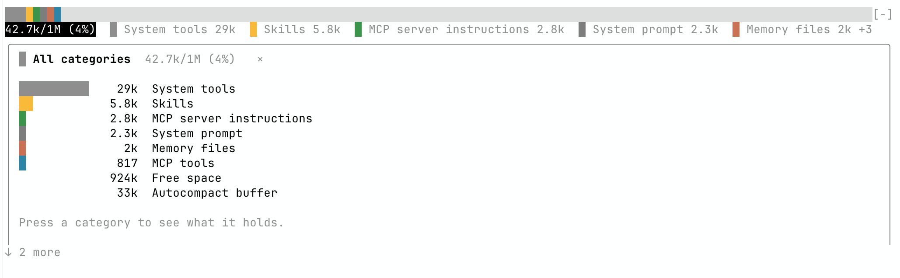
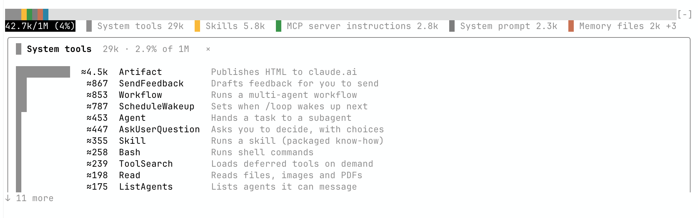
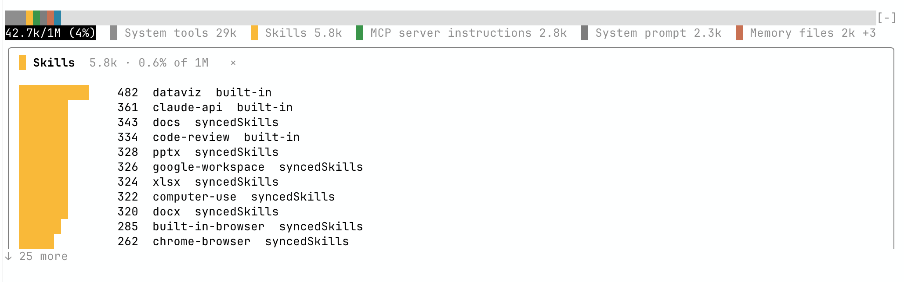
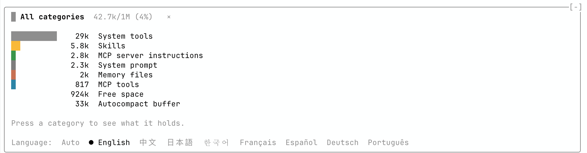
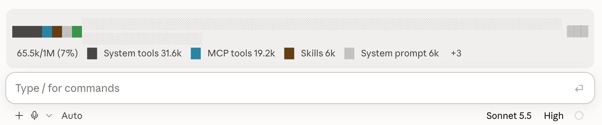
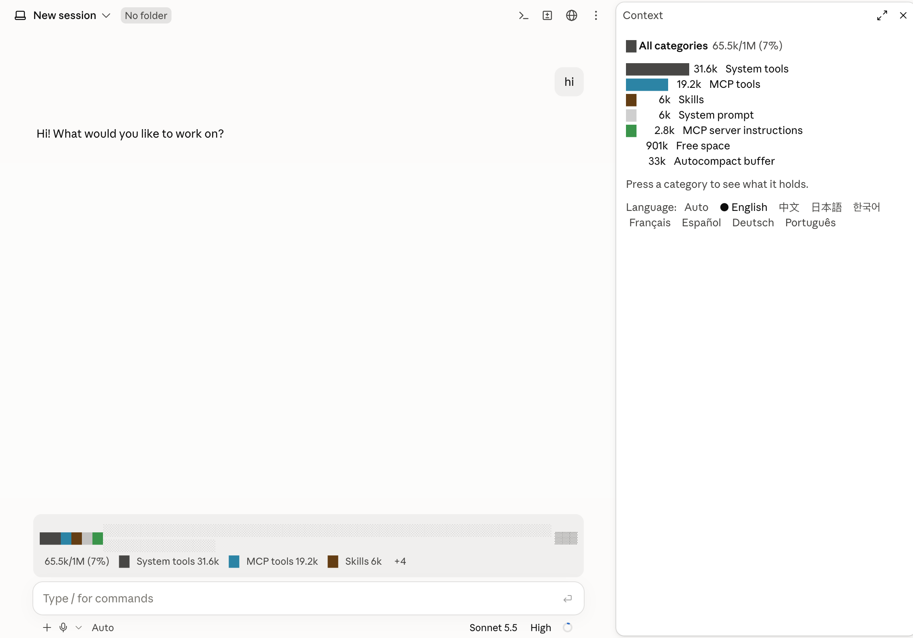
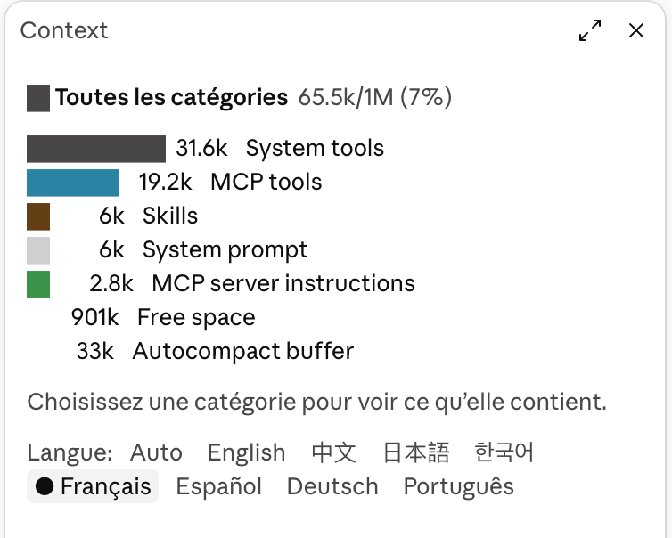

# Context Bar

Your Claude Code context window as a stacked bar above the prompt, one color per `/context` category, so you see at a glance how full the window is and what fills it. Click a category to open a panel with what it holds.

在 Claude Code 的提示框上方，用一条彩色堆叠条显示上下文窗口的占用。每种颜色对应 `/context` 里的一个分类，一眼就能看出窗口用了多少、被什么占着。点击分类会打开一个面板，显示这一类里具体有什么。

## What it looks like · 效果

### In a terminal (Claude Code CLI) · 终端（Claude Code CLI）



**The bar and every category.** The bar sits above the prompt, one color per `/context` category: on the left the fill (42.7k of a 1M window), then the largest categories. Click the fill to open every category under the bar, largest first.

**横条和全部分类。** 提示框上方的横条，每种颜色对应 `/context` 的一个分类：左边是总占用（1M 窗口里用了 42.7k），后面是占用最多的几类。点总数会在横条下方展开全部分类，从大到小排。



**What fills a category.** Click System tools to list every built-in tool with a line on what it does. Their sizes are estimates from each tool's description (≈).

**看一类里是什么。** 点 System tools，会列出每个内置工具和一句说明；大小按工具说明的长度估算（≈）。



**Exact sizes where /context has them.** Skills, memory files and MCP tools show the sizes `/context` counts, and where each one comes from: built in, synced from claude.ai, or your own.

**`/context` 有的就给准确数字。** Skills、记忆文件和 MCP 工具显示 `/context` 统计的大小，以及来源：内置、从 claude.ai 同步，或者你自己的。



**Eight languages.** Pick one at the foot of the detail, or leave it on Auto to follow the language you write in.

**8 种语言。** 在明细底部选择，或者保持「自动」，跟随你输入的语言。

### In the Claude Code desktop app · Claude Code 桌面版



**The bar above the message box.** The same bar in the desktop app: the fill on the left, the largest categories after it.

**输入框上方的横条。** 桌面版里也是同一条横条：左边是总占用，后面是占用最多的几类。



**The detail opens beside the conversation.** In the desktop app, clicking a category opens the Context panel on the right; here it shows every category.

**明细在对话旁边打开。** 在桌面版里点一个分类，右侧会打开 Context 面板；图中显示的是全部分类。



**In French.** The same panel after picking Français at its foot: titles, hints and tool notes follow the language, and category names stay as Claude Code gives them.

**法语界面。** 同一个面板在底部选了 Français 之后：标题、提示和工具说明都跟着切换，分类名保持 Claude Code 给的原名。

## Install · 安装

```bash
claude plugin marketplace add skysf/skylu-mods
claude plugin install context-bar@skylu
```

Start a new Claude Code session afterwards.

装完后新开一个 Claude Code 会话即可。

## Use · 使用

- **The bar** sits above the prompt and refreshes after each turn, after tool calls and after a compaction. Used categories come first, largest first, then the free space (`░`) and the auto-compact buffer (`▒`). <br> **横条**在提示框上方，每轮对话、工具调用和压缩之后自动刷新。已用的分类排在前面、从大到小，然后是空余（`░`）和自动压缩预留（`▒`）。
- **Details:** click a category under the bar to see what it holds: memory files, skills, MCP tools, built-in tools with a line on what each one is, and how the last request used the prompt cache. Click the total (`42.7k/1M (4%)`) or `+N` to see every category. In a terminal the detail opens right under the bar, above the prompt, at any width; click the same entry again, or its ×, to hide it. In the desktop app it opens in a panel. <br> **明细：**点击横条下面的分类，可以看这一类里有什么：记忆文件、skills、MCP 工具、内置工具（每个工具附一句说明），以及上一次请求的缓存情况。点击总数或 `+N` 可以看全部分类。在终端里，明细不论宽窄都直接展开在横条下方、提示框上方，再点一次同一项或点 × 收起；在桌面版里会打开一个面板。
- **Clicking** works in Claude Code's fullscreen mode. Otherwise press `ctrl+x tab` to move the focus to the bar and pick an entry with the keyboard. <br> **鼠标点击**需要 Claude Code 的全屏模式；不是全屏时，按 `ctrl+x tab` 把焦点移到横条上，再用键盘选择。
- **`/context-bar`** turns the bar off and on; `/context-bar on` and `/context-bar off` set it. The choice is remembered. <br> **`/context-bar`** 开关横条，`/context-bar on` 和 `/context-bar off` 直接设定，选择会被记住。
- **Language:** the panel speaks English, 中文, 日本語, 한국어, Français, Español, Deutsch and Português. Pick one with the buttons at the foot of the panel or `/context-bar lang <code>` (`en`, `zh`, `ja`, `ko`, `fr`, `es`, `de`, `pt`); **Auto**, the default, follows the language you write in. The choice is remembered. <br> **语言：**面板支持 English、中文、日本語、한국어、Français、Español、Deutsch、Português。用面板底部的按钮或 `/context-bar lang <代码>` 选一种；默认的**自动**跟随你输入的语言。选择会被记住。

## What the numbers are · 数字说明

- The figures are Claude Code's own `/context` breakdown, estimated locally: the same numbers `/context` shows. <br> 数据就是 Claude Code 自己的 `/context` 分类统计（本地估算），和 `/context` 显示的一致。
- A built-in tool's size is estimated from its description, about four characters a token. The tools' input schemas are not itemized, so the rows add up to less than the System tools total. <br> 内置工具的大小按每个工具说明的长度估算（约 4 个字符算 1 个 token）。工具的参数 schema 无法逐个拆分，所以各行加起来会小于 System tools 的总数。

## Privacy · 隐私

Context Bar runs inside Claude Code's plugin runtime. It reads Claude Code's own context figures and tool descriptions; while the language is set to Auto, it also reads the text of the prompts you send, only to tell which language you write in, and keeps nothing of that text. It stores three settings in Claude Code's local plugin store: whether the bar is shown, the language you picked (or Auto), and the language last detected. It never reads your files, never runs commands, and never sends anything over the network.

Context Bar 运行在 Claude Code 的插件环境里。它读取 Claude Code 自己的上下文统计和工具说明；语言设为「自动」时，还会读取你发出的消息文字，但只用来判断你用的是哪种语言，不保留任何内容。它在 Claude Code 本地的插件存储里记三项设置：是否显示横条、你选的语言（或「自动」）、最近判断出的语言。它不读你的文件，不执行命令，也不通过网络发送任何数据。

Full privacy policy · 完整隐私政策：[PRIVACY.md](PRIVACY.md)

## What it hooks · 它挂了哪些钩子

Context Bar listens to a few Claude Code events and changes none of them:

Context Bar 只监听下面几个 Claude Code 事件，不修改其中任何一个：

| Event · 事件 | What Context Bar does · 做什么 |
| --- | --- |
| `session.start` | Registers `/context-bar`, reads its two remembered settings and takes the first reading. <br> 注册 `/context-bar` 命令，读取记住的两项设置，取第一次数据。 |
| `command.run` | Answers its own `/context-bar` only; every other command passes through untouched. <br> 只响应自己的 `/context-bar`，其他命令原样放行。 |
| `prompt.submit` | Under Auto only, reads the prompt's text to tell its language; the prompt goes on unchanged and is not kept. <br> 仅在「自动」语言下读取你发出的消息文字来判断语言；消息原样发出，不保留。 |
| `tool.describe` | Measures the length of each built-in tool's description; the description reaches the model unchanged. <br> 量每个内置工具说明的长度；说明原样交给模型，不做修改。 |
| `session.measure`, `tool.call`, `session.compact`, `session.end` | Schedules a fresh reading of the context figures, nothing else. <br> 只用来安排刷新上下文数据，不做别的。 |
| `ui.close` | Notes that its own panel was closed. <br> 记录自己的面板已关闭。 |
| `ui.render` | Draws the bar above the prompt, and the detail under it in a terminal or in a panel in the desktop app. <br> 画提示框上方的横条，以及明细（终端里在横条下方，桌面版里在面板中）。 |

## Requirements · 要求

- Claude Code 2.1.288 or newer; update with `claude update`. <br> 需要 Claude Code 2.1.288 或更新版本，用 `claude update` 升级。
- Context Bar is built on Claude Code's mod API, which is in early access and may change between releases. <br> Context Bar 基于 Claude Code 还在早期预览阶段的 mod 接口，可能随版本变化。

## License · 许可证

[MIT](LICENSE) © [skylu](https://www.skylu.ai)
